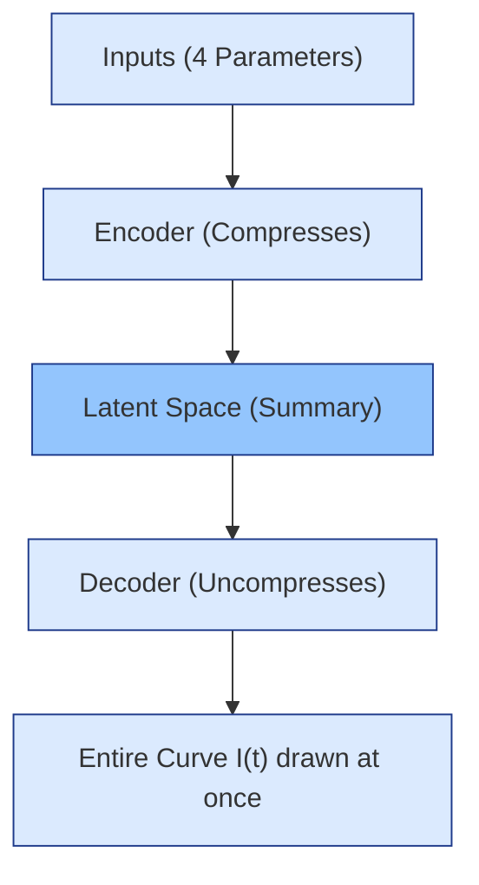
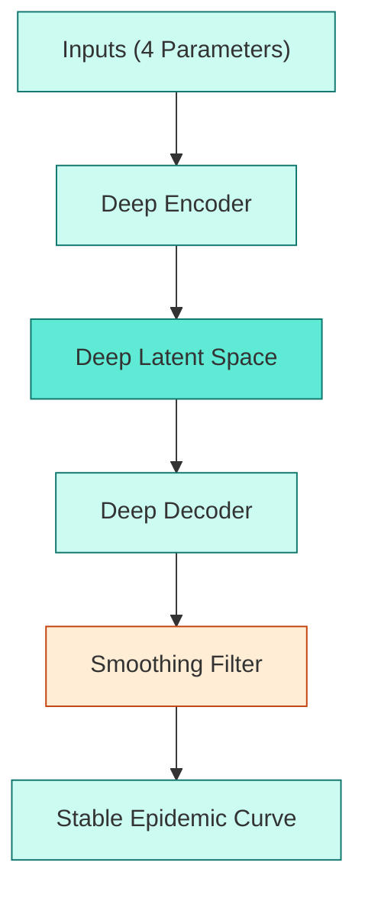
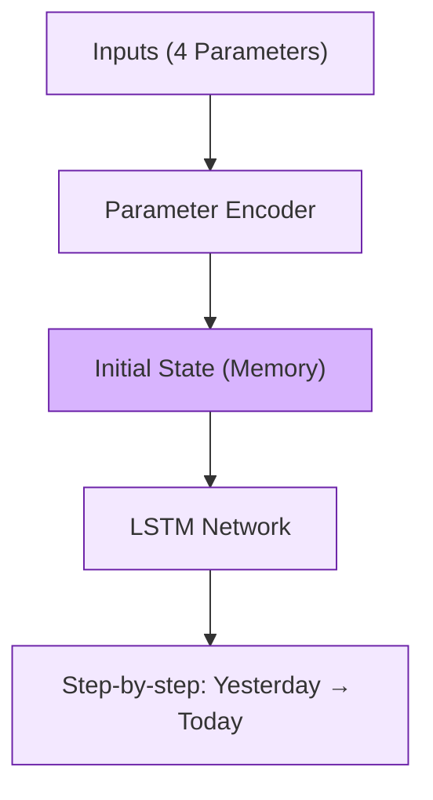
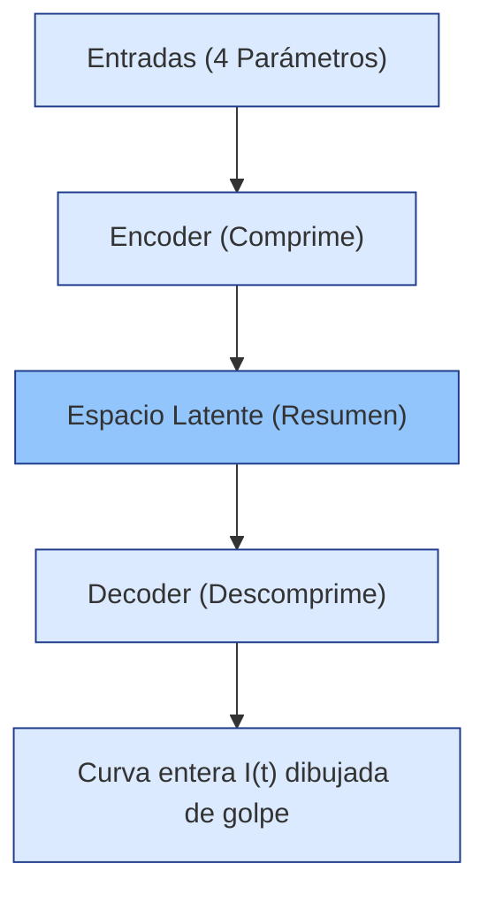
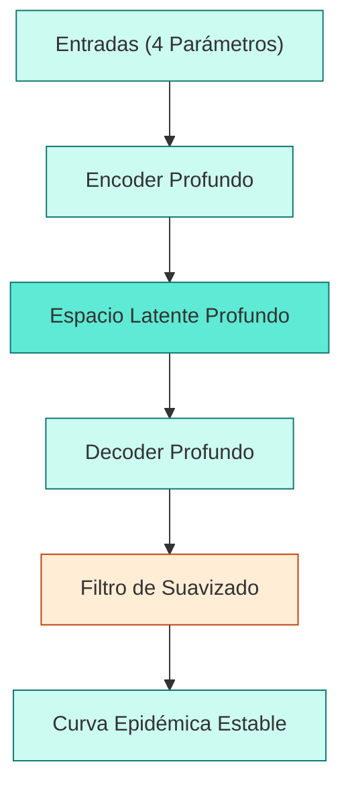
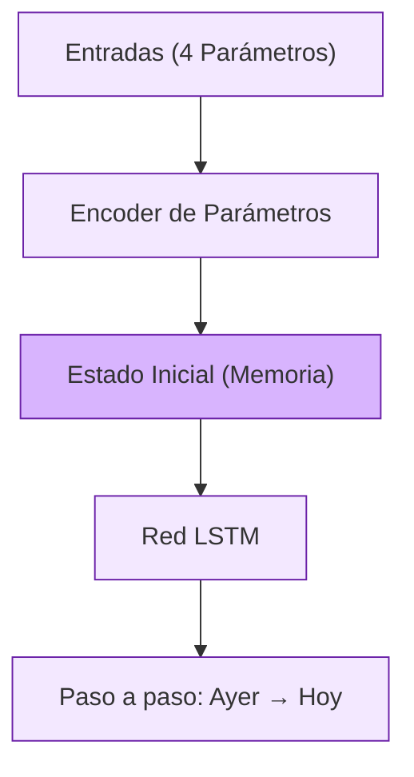

# Explanation of AI Surrogate Architectures (Explicación de las Arquitecturas de IA)

This document explains the models found in `ArchNN.txt` simply, with diagrams to help visualize them.
Este documento explica los modelos de `ArchNN.txt` de forma sencilla, con diagramas para visualizarlos mejor.

---

## 🇬🇧 English Explanation

These AI models act as "surrogates" (fast replacements) for a slow epidemic simulator. They take 4 initial parameters and predict the epidemic curve.

### 1. Basic Autoencoder (Basic AE)
- **What it does:** It compresses the starting parameters into a small summary (latent space), and then uncompresses them to draw the entire epidemic curve all at once.
- **Pros & Cons:** Very fast, but it doesn't "understand" the step-by-step passing of time.

### 2. Deep Autoencoder + Smoothing (Deep AE + Smooth)
- **What it does:** Similar to the basic one, but deeper/more complex. At the end, it uses a "smoothing filter".
- **Pros & Cons:** The smoothing filter prevents the predicted curve from having weird, sudden jumps.

### 3. Autoregressive LSTM (LSTM)
- **What it does:** It uses parameters to set up an initial "memory state". Then, it generates the curve day by day, using yesterday's data to predict today.
- **Pros & Cons:** It is the closest to how the real simulator works because it respects the step-by-step sequence of time.

---

## 🇪🇸 Explicación en Español

Estos modelos de IA actúan como "sustitutos" (reemplazos rápidos) de un simulador lento. Toman 4 parámetros e intentan predecir la curva de la epidemia.

### 1. Autoencoder Básico (Basic AE)
- **Qué hace:** Comprime los parámetros iniciales en un pequeño resumen (espacio latente) y luego los descomprime para dibujar toda la curva de una sola vez.
- **Pros y Contras:** Es muy rápido, pero no "entiende" el paso del tiempo día a día.

### 2. Autoencoder Profundo + Suavizado (Deep AE + Smooth)
- **Qué hace:** Similar al básico, pero más grande y complejo. Al final, utiliza un "filtro de suavizado".
- **Pros y Contras:** El filtro evita que la curva predicha tenga saltos extraños y repentinos.

### 3. LSTM Autorregresivo (LSTM)
- **Qué hace:** Utiliza los parámetros iniciales para configurar un "estado de memoria" inicial. Luego, genera la curva día a día, utilizando los datos de ayer para predecir los de hoy.
- **Pros y Contras:** Es el que más se parece a cómo funciona el simulador real porque respeta la secuencia del tiempo paso a paso.

