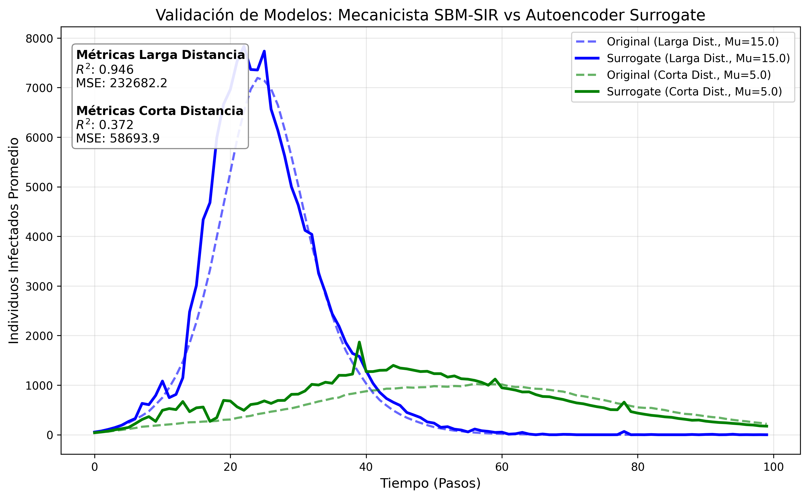

# SBM-SIR Epidemiological Modeling with an AI Surrogate

This project implements a computational epidemiology pipeline to simulate an epidemic on SBM-style networks, train an AI-based surrogate model, and compare the model behavior against real daily case data from Russia in 2022.

The core idea is to combine two approaches:

1. A mechanistic SBM-SIR model that simulates contagion over a spatial population network with hubs and mobile/static population groups.
2. A neural surrogate model that learns to approximate the curves generated by the original simulator, enabling faster parameter evaluation.

The real-data fit is phenomenological: the model produces a simulated infected fraction, which is then scaled to reported daily cases.

## Objective

Develop and evaluate a network-based epidemiological model capable of:

- Generating a synthetic Stochastic Block Model (SBM) network.
- Adding spatial restrictions through a Fermi-Dirac-style function.
- Simulating SIR dynamics over a stratified population.
- Training a neural surrogate to approximate the simulator.
- Fitting both the surrogate and the original SBM model to real Russia 2022 data.
- Comparing the surrogate performance against the original simulator.

## General Pipeline

```text
Epidemiological and spatial parameters
        |
        v
SBM network generation with hubs and 2D positions
        |
        v
Hub projection into block-to-block connections
        |
        v
Stochastic SIR simulation on the network
        |
        v
Synthetic dataset of epidemic curves
        |
        v
Autoregressive LSTM surrogate training
        |
        v
Fit to real Russia 2022 data
        |
        v
Comparison: surrogate vs original SBM
```

## Mechanistic SBM-SIR Model

The main simulator is implemented in `simple_sbm_generator.py`.

The model generates an SBM network with three node types:

- Social blocks.
- Hubs.
- Non-social blocks.

Nodes are placed in a 2D space, and connections are modulated by distance using:

```text
P(d) = 1 / (exp(beta * (d - mu)) + 1)
```

Where:

- `d` is the distance between nodes.
- `beta` controls the transition slope.
- `mu` represents the spatial connectivity threshold.

Small `mu` values represent local/restrictive connectivity. Larger `mu` values allow longer-range connections.

The SIR simulation includes:

- Mobile and static population per node.
- Internal household/block infection.
- External network-neighbor infection.
- Stochastic recovery.
- Multiple replicas to capture variability.

## Hub Projection

Hubs represent shared places such as:

- Offices.
- Transport.
- Schools.
- Shops.

When several blocks connect to the same hub, the model projects that hub into additional block-to-block edges. This captures indirect contacts through shared places without keeping hubs as final simulation nodes.


## Spatial Experiment: Small Mu vs Large Mu

Two scenarios were compared:

| Scenario | `mu` value | Interpretation |
|---|---:|---|
| Restrictive | 5 | Connections depend strongly on spatial proximity |
| Free | 15 | Distance limits connectivity less strongly |

Results from repeated simulations:

| Metric | Small/restrictive mu | Large/free mu |
|---|---:|---:|
| Mean infection peak | 1240.67 +/- 281.88 | 7523.32 +/- 330.77 |
| Accumulated infected | 35379.82 +/- 6605.26 | 76344.08 +/- 1284.00 |
| Infected at final iteration | 244.47 +/- 193.59 | 0.00 +/- 0.00 |


## Synthetic Dataset for AI

The dataset is generated by running the original simulator with different parameter values:

- `beta_network`
- `beta_household`
- `delta`
- `fermi_mu`

Generated file:

```text
output/ai_sbm/dataset_normalized.npz
```

Current dimensions:

| Variable | Dimension |
|---|---:|
| `X` parameters | 300 x 4 |
| `Y` infected curves | 300 x 100 |

Observed parameter ranges in the dataset:

| Parameter | Minimum | Maximum |
|---|---:|---:|
| `beta_network` | 0.1094 | 0.7999 |
| `beta_household` | 1.0027 | 3.4988 |
| `delta` | 0.6024 | 1.1966 |
| `fermi_mu` | 2.0014 | 19.9462 |

Each `Y` curve represents the mean infected fraction normalized by population.

## AI Surrogate Model

The surrogate is defined in `AI_SBM.py` as `EpidemicSurrogateNet`.

Architecture:

- Input: 4 epidemiological/spatial parameters.
- MLP encoder that maps parameters into an initial recurrent state.
- Autoregressive LSTM that generates the temporal curve.
- Output: infected-fraction curve over 100 time steps.

The training loss combines:

- Full-curve MSE.
- Epidemic peak error.
- First temporal derivative error.
- Second temporal derivative error.

This encourages the surrogate to learn not only pointwise values, but also the dynamic shape of the epidemic curve.


## Surrogate Evaluation

Current metrics on the test split:

| Metric | Value |
|---|---:|
| MSE | 0.00000427 |
| MAE | 0.00082234 |
| R2 | 0.9872 |

File:

```text
output/ai_sbm/eval_metrics_normalized.txt
```

Visual validation of the surrogate against the original simulator:



Population-normalized validation:


## Real Data: Russia 2022

The file `Data_Rusia_2022.csv` contains daily new cases for Russia. The real data were obtained from the official World Health Organization dashboard:

```text
https://data.who.int/dashboards/covid19/data?utm_source=chatgpt.com
```

Included period:

| Start | End | Days |
|---|---|---:|
| 2021-12-28 | 2022-03-28 | 91 |

The variable used for fitting is:

```text
Casos nuevos
```

Direct visualization of the real reference series:


## Surrogate Fit to Russia 2022

Script:

```text
fit_rusia_with_surrogate.py
```

The fit uses `differential_evolution` to search for surrogate parameters and a temporal displacement (`shift_days`). The simulated infected fraction is then scaled to real case counts.

Current optimal parameters:

| Parameter | Value |
|---|---:|
| `beta_net` | 0.7530654572 |
| `beta_hh` | 1.142348201 |
| `delta` | 0.8147158245 |
| `fermi_mu` | 8.474368556 |
| `shift_days` | 3.640185258 |
| `scale_cases` | 21491861.58 |

Metrics:

| Metric | Value |
|---|---:|
| MSE | 94290892.27 |
| MAE | 7917.95224 |
| R2 | 0.97495529 |
| Shape MSE | 0.002713140376 |
| Optimizer loss | 0.002713140376 |


## Original SBM Fit to Russia 2022

Script:

```text
fit_rusia_with_original_sbm.py
```

This fit uses the parameters found by the surrogate as the initial seed, then evaluates the original SBM simulator with 20 replicas per objective evaluation.

Current optimal parameters:

| Parameter | Value |
|---|---:|
| `beta_net` | 0.7286968381 |
| `beta_hh` | 1.1433071362 |
| `delta` | 0.8121867768 |
| `fermi_mu` | 8.9737480256 |
| `shift_days` | 7.0372262655 |
| `scale_cases` | 17200827.1546 |
| `num_sims` | 20 |

Metrics:

| Metric | Value |
|---|---:|
| MSE | 82108155.8 |
| MAE | 7276.448763 |
| R2 | 0.9781911603 |
| Shape MSE | 0.002471826329 |
| Optimizer loss | 0.002471826329 |

Note: the optimizer reported `optimizer_success: False` because it reached the maximum number of function evaluations. Even so, the final fit has strong numerical performance.


## Main Comparison

| Model | R2 | MAE | Shape MSE |
|---|---:|---:|---:|
| AI surrogate | 0.97495529 | 7917.95224 | 0.002713140376 |
| Original SBM | 0.9781911603 | 7276.448763 | 0.002471826329 |

The original SBM achieves a slightly better fit, but the surrogate can explore the parameter space much faster. This supports using the surrogate as an initial calibration tool or as an efficient approximation of the simulator.

## Execution-Time Comparison

Evaluation time was measured using the optimal parameters from the original SBM fit:

```text
beta_net = 0.7286968381
beta_hh = 1.1433071362
delta = 0.8121867768
fermi_mu = 8.9737480256
```

The comparison measures the time required to generate one 100-step epidemic curve. For the surrogate, this measures inference with the already-trained model; it does not include training time. For the SBM, this measures direct mechanistic simulation.

| Model | Measured configuration | Time |
|---|---:|---:|
| AI surrogate | 1 prediction | 0.00498 s |
| AI surrogate | 1000 predictions | 4.97563 s |
| Original SBM | 1 simulation | 1.20093 s |
| Original SBM | 20 simulations | 2.77914 s |

Speed comparison:

| Comparison | Approximate speedup |
|---|---:|
| Surrogate vs SBM with 1 simulation | 241.4x faster |
| Surrogate vs SBM with 20 simulations | 558.6x faster |

Interpretation: the original SBM preserves the full mechanistic dynamics and obtains a slightly better fit, but each evaluation is much more expensive. The surrogate enables rapid exploration of many parameter values, making it useful as an initial calibration approximator.

## Results Gallery

This section collects the main figures generated by the project.

### SBM Network and Spatial Effect


### Architecture and Surrogate


### Fit to Real Data


## Main Files

| File | Description |
|---|---|
| `simple_sbm_generator.py` | SBM generator, hub projection, and SIR simulation |
| `test_simulation.py` | Numerical configuration and base spatial experiment |
| `AI_SBM.py` | Dataset generation, surrogate architecture, training, and evaluation |
| `fit_rusia_with_surrogate.py` | Surrogate fit against real Russia data |
| `fit_rusia_with_original_sbm.py` | Original SBM simulator fit against real Russia data |
| `Data_Rusia_2022.csv` | Real daily case data |
| `model_output.py` | Simple result container for SIR trajectories |

## Generated Outputs

| File | Description |
|---|---|
| `plot_rusia_2022.png` | Visualization of the real Russia 2022 data |
| `output/infectados_mu_small_vs_mu_infty.png` | Epidemic comparison under different spatial restrictions |
| `output/simple_sbm_comparison.png` | Original vs projected network comparison |
| `output/ai_sbm/dataset_normalized.npz` | Synthetic dataset for surrogate training |
| `output/ai_sbm/surrogate_model_normalized.pth` | Trained surrogate weights |
| `output/ai_sbm/eval_metrics_normalized.txt` | Surrogate evaluation metrics |
| `output/ai_sbm/estructura_red_lstm_surrogate.svg` | LSTM surrogate architecture diagram |
| `output/ai_sbm/arquitectura_red_entrenada_colormap.png` | Visualization of the trained architecture |
| `output/ai_sbm/nodos_red_entrenada_colormap.svg` | Visualization of trained network nodes |
| `output/ai_sbm/validacion_surrogate_comparativa.png` | Visual validation of the surrogate against the simulator |
| `output/ai_sbm/validacion_surrogate_comparativa_normalizada.png` | Visual validation of the surrogate against the simulator |
| `output/ai_sbm/ajuste_rusia_surrogate_shift.txt` | Parameters and metrics from the surrogate fit |
| `output/ai_sbm/ajuste_rusia_surrogate_shift.png` | Surrogate fit plot |
| `output/ai_sbm/ajuste_rusia_sbm_original_20sims.txt` | Parameters and metrics from the original SBM fit |
| `output/ai_sbm/ajuste_rusia_sbm_original_20sims.png` | Original SBM fit plot |

## How to Run

Install dependencies:

```bash
pip install numpy scipy networkx matplotlib pandas scikit-learn torch
```

Run the AI pipeline:

```bash
python3 AI_SBM.py
```

Fit the surrogate to Russia:

```bash
python3 fit_rusia_with_surrogate.py
```

Fit the original SBM to Russia using the surrogate seed:

```bash
python3 fit_rusia_with_original_sbm.py --num-sims 20 --maxiter 25 --maxfev 80
```

## Limitations

- The real-data fit is phenomenological, not causal.
- The model uses a synthetic network, not a real Russian mobility network.
- Reported case counts are matched through a posterior scale factor, `scale_cases`.
- A high R2 indicates good shape fit, but it does not prove that the parameters are uniquely identifiable.
- The current original SBM fit reached the optimizer evaluation limit.
- A formal thesis version should add sensitivity analysis, confidence intervals, and comparisons against baseline models.

## Academic Interpretation

This project is an applied AI and computational modeling study. Its main contribution is using a neural surrogate to approximate a network-based epidemiological simulator and using that surrogate as a calibration tool against real data.

A suitable thesis framing would be:

```text
Network-based SBM epidemiological model with an autoregressive neural surrogate for efficient calibration against real incidence data.
```
