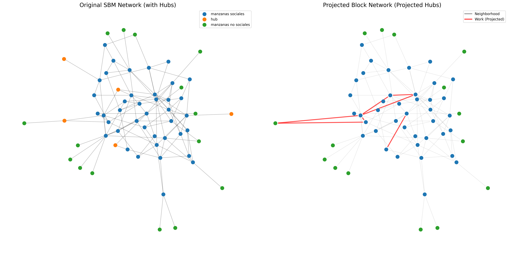
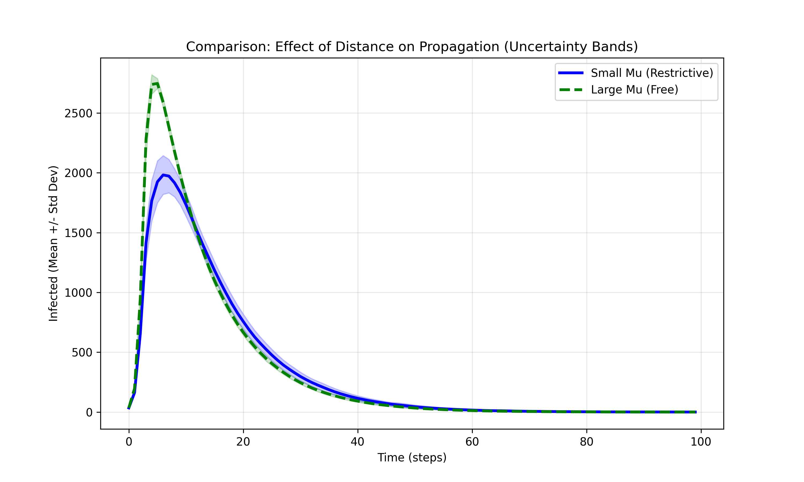
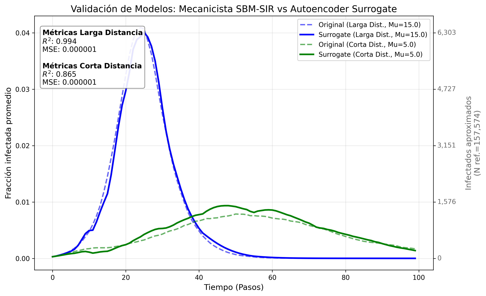
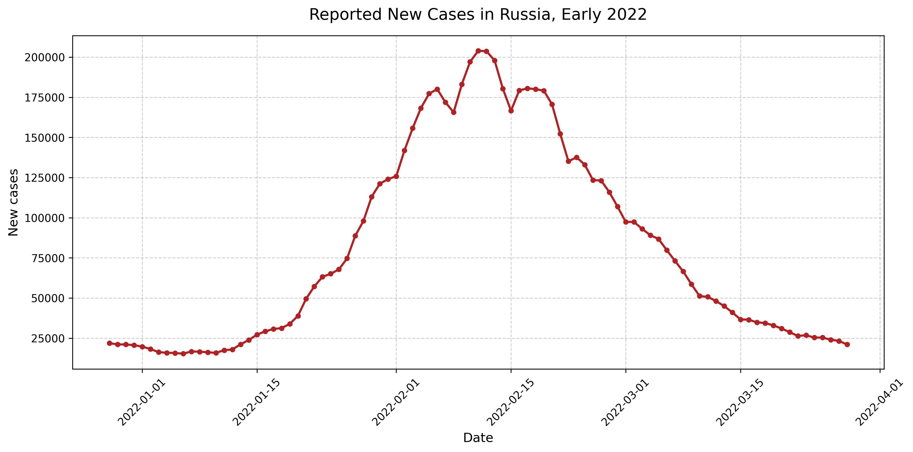
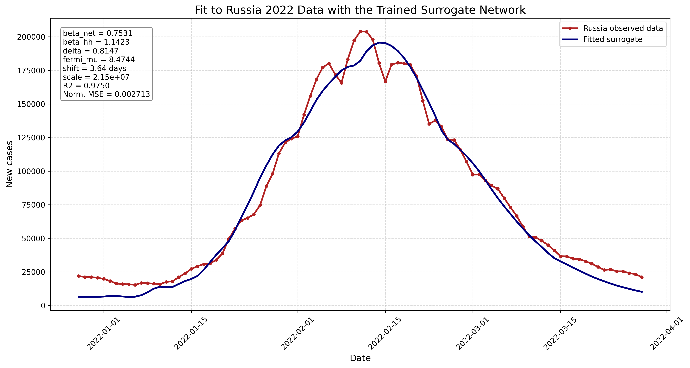

# Aggregate Spatial Network Modeling of Epidemic Spread with an AI Surrogate

This repository implements a compact computational framework for modeling epidemic spread in urban populations using an aggregate spatial network and an artificial intelligence surrogate model. The objective is to evaluate whether a simplified network can reproduce the effect of spatial contact constraints while accelerating parameter exploration and calibration.

The model combines a modified stochastic block model (SBM), hub-mediated contact projection, stochastic susceptible-infected-recovered (SIR) dynamics, and a neural surrogate based on an encoder plus autoregressive LSTM architecture. The real-data fit is phenomenological: the simulator produces an infected fraction curve, which is shifted in time and scaled to reported daily cases.

## Keywords

epidemic modeling; spatial networks; stochastic block model; hub projection; susceptible-infected-recovered model; artificial intelligence surrogate model; long short-term memory network; parameter calibration; computational epidemiology.

## Overview

The project follows a two-stage modeling strategy:

1. The **AI surrogate model** rapidly explores the parameter space and provides an initial calibration.
2. The **original SBM-SIR simulator** refines that solution through repeated stochastic simulations, preserving the mechanistic interpretation of the network model.

```text
Epidemiological and spatial parameters
        |
        v
Aggregate SBM network with hubs and 2D positions
        |
        v
Hub projection into block-to-block weighted links
        |
        v
Stochastic SIR simulation
        |
        v
Synthetic epidemic-curve dataset
        |
        v
Encoder + LSTM surrogate training
        |
        v
Calibration against Russia 2022 daily cases
        |
        v
Comparison between surrogate and original simulator
```

## Aggregate Spatial Network

The network is generated as a modified stochastic block model with three node categories:

- **Social blocks**: populated residential/social units.
- **Hubs**: shared urban locations such as schools, offices, transportation points, and shops.
- **Non-social blocks**: populated units with lower mobility.

The current block sizes are:

| Node type | Count |
|---|---:|
| Social blocks | 435 |
| Hubs | 75 |
| Non-social blocks | 490 |

The original graph therefore starts with 1000 nodes before hub projection. The base mixing matrix is:

```text
B = (1 / 1000) * [[80, 4, 5],
                  [ 4, 0, 1],
                  [ 5, 1, 1]]
```

Each node is assigned a position in a 2D abstract spatial domain. Distance restriction is introduced with a Fermi-Dirac function:

```text
f(d) = 1 / (exp(beta_F * (d - mu)) + 1)
```

Small `mu` values represent restrictive spatial connectivity, while larger `mu` values allow longer-range mixing.

## Hub Projection

Hubs are not retained as final population nodes. Instead, they are projected as effective links between populated blocks. Two blocks can therefore interact indirectly if they share a school, workplace, transport point, or shop.

When multiple interaction channels exist between two blocks, their combined weight is computed as:

```text
W_ij = 1 - product_k(1 - w_ij_k)
```

This represents the probability that at least one interaction channel connects the two blocks.

Interaction weights used in the aggregate network:

| Interaction type | Weight |
|---|---:|
| Social-social | 0.10 |
| Social-non-social | 0.06 |
| Non-social-non-social | 0.03 |
| Office | 0.03 |
| Transport | 0.02 |
| School | 0.99 |
| Shop | 0.01 |



## Stochastic Epidemic Dynamics

Each populated node contains mobile and static subpopulations:

```text
N_i = N_i_mobile + N_i_static
```

Current population rules:

| Node type | Population range | Mobile fraction |
|---|---:|---:|
| Social blocks | 200-280 | 0.7 |
| Non-social blocks | 200-280 | 0.4 |
| Hubs | 0 | 0.0 |

The simulator tracks susceptible, infected, and recovered individuals for mobile and static groups separately. Initial infections are assigned globally using:

```text
K = max(K_min, round(rho_0 * N_total))
```

Current initialization:

| Parameter | Value |
|---|---:|
| Initial infected fraction, `rho_0` | 0.0003 |
| Minimum initial infected, `K_min` | 20 |
| Mobile infection bias | 0.7 |

The epidemic process combines:

- Stochastic recovery.
- Internal transmission inside each populated block.
- External transmission through weighted network links.
- External infection applied to mobile susceptible individuals.

This structure separates local contagion within population units from mobility-driven contagion between units.

## AI Surrogate Model

The surrogate model approximates the simulator mapping:

```text
(beta_network, beta_household, delta, mu) -> infected fraction curve
```

It is implemented in `AI_SBM.py` as `EpidemicSurrogateNet`.

Architecture:

- Four-parameter input.
- Multi-layer encoder.
- Autoregressive LSTM recurrent model.
- 100-step normalized infected-fraction output.

The loss combines:

- Full-curve mean squared error.
- Epidemic peak error.
- First derivative error.
- Second derivative error.

This encourages the surrogate to learn the epidemic shape, including growth, peak, decline, and curvature.


## Calibration Protocol

Calibration uses two stages:

1. The surrogate model searches rapidly for a good parameter configuration.
2. The original simulator is initialized from that solution and refined with repeated stochastic simulations.

The fitted parameter vector is:

```text
theta = (beta_network, beta_household, delta, mu, shift_days)
```

The model curve is shifted in time and compared with the normalized empirical curve. After the best shape is found, a scale coefficient converts the infected fraction into reported daily cases:

```text
predicted_cases(t) = scale * infected_fraction(t - shift_days)
```

The fit should therefore be interpreted as shape calibration plus amplitude scaling, not as a causal reconstruction of reported cases.

## Spatial Experiment

The spatial experiment compares two regimes:

| Regime | `mu` value | Interpretation |
|---|---:|---|
| Restrictive | 5 | Stronger spatial limitation |
| Freer | 15 | Longer-range mixing |

Results from repeated simulations:

| Metric | Restrictive regime | Freer regime |
|---|---:|---:|
| Infection peak | 1240.67 +/- 281.88 | 7523.32 +/- 330.77 |
| Cumulative infected | 35379.82 +/- 6605.26 | 76344.08 +/- 1284.00 |
| Infected in final iteration | 244.47 +/- 193.59 | 0.00 +/- 0.00 |

The restrictive regime produces a lower and more prolonged outbreak. The freer regime increases effective connectivity and concentrates infections into a higher and earlier peak.



## Surrogate Validation

The normalized validation compares the original SBM-SIR simulator against the surrogate model in short-distance and long-distance regimes. Dashed curves correspond to the original simulator, and solid curves correspond to the surrogate prediction.

This figure has two roles:

- It shows that the spatial parameter `mu` modifies epidemic dynamics clearly.
- It verifies that the surrogate reproduces the simulator's curve shape before using it for real-data calibration.



## Fit to Russia 2022 Data

The file `Data_Rusia_2022.csv` contains real daily new cases for Russia. These empirical data were obtained from the official World Health Organization COVID-19 dashboard:

```text
https://data.who.int/dashboards/covid19/data
```

The fitted variable is:

```text
Casos nuevos
```

This variable corresponds to reported daily new cases and is used as the empirical reference curve for calibration.

Reference period:

| Start | End | Days |
|---|---|---:|
| 2021-12-28 | 2022-03-28 | 91 |

Direct visualization:



## Fit Results

The surrogate fit reached an approximate coefficient of determination of 0.975. The original simulator, refined from the surrogate solution, reached approximately 0.978.

| Model | R2 | MAE | Shape error |
|---|---:|---:|---:|
| AI surrogate | 0.97495529 | 7917.95224 | 0.002713140376 |
| Original simulator | 0.9781911603 | 7276.448763 | 0.002471826329 |

The original simulator obtains a slightly better fit, while the surrogate provides faster parameter exploration.

### Surrogate Fit

| Parameter | Value |
|---|---:|
| `beta_net` | 0.7530654572 |
| `beta_hh` | 1.142348201 |
| `delta` | 0.8147158245 |
| `fermi_mu` | 8.474368556 |
| `shift_days` | 3.640185258 |
| `scale_cases` | 21491861.58 |



### Original Simulator Fit

| Parameter | Value |
|---|---:|
| `beta_net` | 0.7286968381 |
| `beta_hh` | 1.1433071362 |
| `delta` | 0.8121867768 |
| `fermi_mu` | 8.9737480256 |
| `shift_days` | 7.0372262655 |
| `scale_cases` | 17200827.1546 |
| `num_sims` | 20 |

The optimizer reached the maximum number of function evaluations, but the final numerical fit remains strong.


## Calibration Time

Execution time was measured for the two calibration procedures against real epidemic data.

| Model | Time |
|---|---:|
| Surrogate | 32.92 s |
| SBM original | 233.62 s |

In minutes:

| Model | Time |
|---|---:|
| Surrogate | 0.55 min |
| SBM original | 3.89 min |

The surrogate fit took **32.92 s**. This corresponds to calibrating the model against Russia data using the already trained neural network, so each parameter evaluation is fast and many combinations can be explored in a short time.

The original SBM fit took **233.62 s**. This process is more expensive because each evaluation requires running mechanistic simulations on the original SBM network. In this configuration, calibration used 20 simulations per evaluation, making the total time considerably longer.

The surrogate calibration was approximately:

```text
233.62 / 32.92 = 7.1
```

times faster than the original SBM calibration. This is a comparison between calibration procedures, not between surrogate training and mechanistic simulation.

Additional plot-generation times:

| Output | Time |
|---|---:|
| `infectados_mu_small_vs_mu_infty` | 20.90 s |
| `validacion_surrogate_comparativa_normalizada` | 8.92 s |

## Interpretation

The results show a clear trade-off between mechanistic fidelity and computational efficiency. The original SBM-SIR simulator preserves the network mechanism and obtains a slightly better fit. The surrogate model reduces calibration time and is useful for rapid parameter search, sensitivity exploration, and repeated scenario evaluation.

The practical strategy is therefore not to choose one model over the other, but to combine them:

1. Use the surrogate model for rapid exploration.
2. Use the original simulator for final mechanistic refinement.

## Main Files

| File | Description |
|---|---|
| `simple_sbm_generator.py` | SBM generator, hub projection, and SIR simulation |
| `test_simulation.py` | Spatial experiment and numerical configuration |
| `AI_SBM.py` | Dataset generation, surrogate architecture, training, evaluation, and validation plot |
| `fit_rusia_with_surrogate.py` | Surrogate calibration against Russia data |
| `fit_rusia_with_original_sbm.py` | Original SBM calibration against Russia data |
| `fit_rusia_with_sir_normal.py` | Baseline SIR fit |
| `generate_english_figures.py` | Regenerates English copies of the AI-SBM and Russia plots |
| `Data_Rusia_2022.csv` | Real daily case data |
| `model_output.py` | Result container for SIR trajectories |

## Generated Outputs

Spanish-language figures are preserved at their original paths. The README displays the English copies stored in `output/ai_sbm/english/`.

| File | Description |
|---|---|
| `output/ai_sbm/english/plot_russia_2022.png` | English visualization of Russia 2022 daily cases |
| `output/simple_sbm_comparison.png` | Original vs projected network comparison |
| `output/infectados_mu_small_vs_mu_infty.png` | Epidemic comparison under restrictive and freer spatial regimes |
| `output/ai_sbm/dataset_normalized.npz` | Synthetic dataset for surrogate training |
| `output/ai_sbm/surrogate_model_normalized.pth` | Trained surrogate weights |
| `output/ai_sbm/eval_metrics_normalized.txt` | Surrogate evaluation metrics |
| `output/ai_sbm/english/estructura_red_lstm_surrogate.svg` | English LSTM surrogate architecture diagram |
| `output/ai_sbm/english/arquitectura_red_entrenada_colormap.png` | English visualization of the surrogate architecture |
| `output/ai_sbm/english/nodos_red_entrenada_colormap.svg` | English visualization of trained network nodes |
| `output/ai_sbm/english/validacion_surrogate_comparativa.png` | English visual validation of the surrogate against the simulator |
| `output/ai_sbm/english/validacion_surrogate_comparativa_normalizada.png` | English normalized validation of surrogate and simulator curves |
| `output/ai_sbm/ajuste_rusia_surrogate_shift.txt` | Parameters and metrics from the surrogate fit |
| `output/ai_sbm/english/ajuste_rusia_surrogate_shift.png` | English surrogate fit plot |
| `output/ai_sbm/ajuste_rusia_sbm_original_20sims.txt` | Parameters and metrics from the original SBM fit |
| `output/ai_sbm/english/ajuste_rusia_sbm_original_20sims.png` | English original SBM fit plot |
| `output/ai_sbm/english/ajuste_rusia_sir_normal.png` | English standard SIR fit plot |

## How to Run

Install dependencies:

```bash
pip install numpy scipy networkx matplotlib pandas scikit-learn torch
```

Generate the spatial comparison plot:

```bash
python3 test_simulation.py
```

Run the AI pipeline:

```bash
python3 AI_SBM.py
```

Fit the surrogate:

```bash
python3 fit_rusia_with_surrogate.py
```

Fit the original SBM using the surrogate seed:

```bash
python3 fit_rusia_with_original_sbm.py --num-sims 20 --maxiter 25 --maxfev 80
```

Regenerate the English figures without overwriting the Spanish originals:

```bash
python3 generate_english_figures.py
```

## Limitations

- The fit to real data is phenomenological, not causal.
- The model uses a synthetic aggregate network, not a reconstructed Russian mobility network.
- Reported cases are matched through a posterior scale factor.
- A high R2 indicates a good shape fit, but does not prove parameter identifiability.
- The original SBM fit reached the optimizer evaluation limit.
- Future work should include sensitivity analysis, confidence intervals, baseline comparisons, and validation against additional epidemic curves.

## Conclusion

This framework provides a compact and computationally efficient approach for studying epidemic spread in urban populations with spatial structure. It is not a full individual-based reconstruction of a city; instead, it is an aggregate model that retains spatial contact structure, hub-mediated interaction, and mobile/static population groups.

The main finding is that restrictive contact structures generate flatter and more prolonged outbreaks, while freer contact structures generate sharper and higher epidemic peaks. The surrogate model approximates the simulator curves and accelerates parameter exploration, while the original simulator remains valuable for final mechanistic interpretation.
