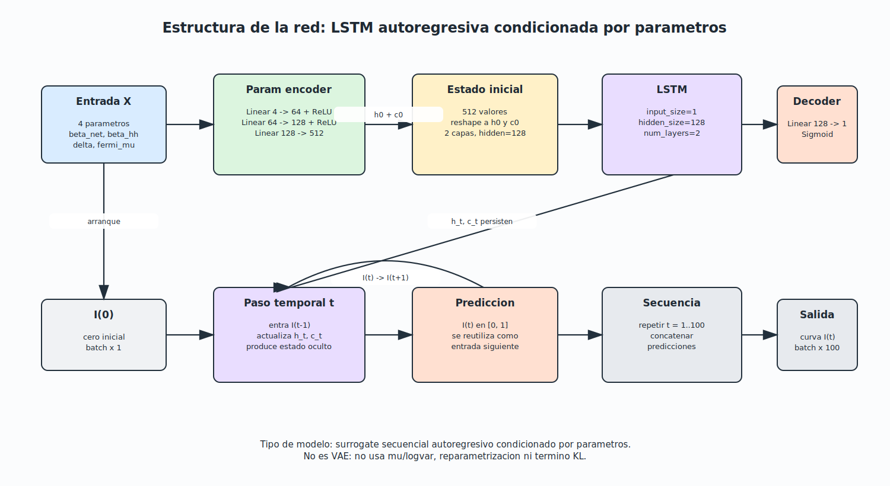
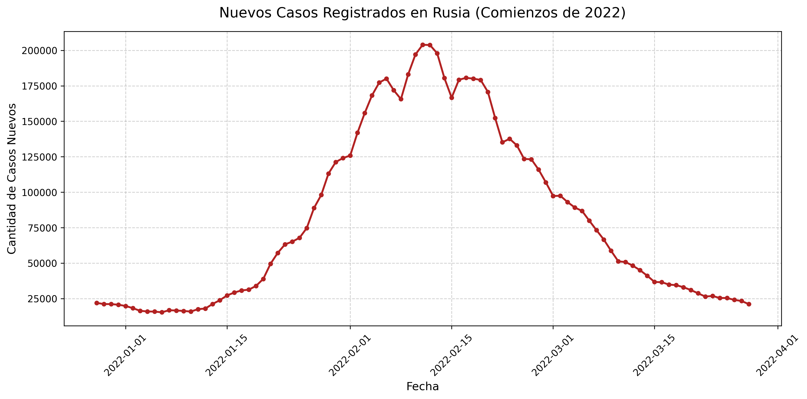
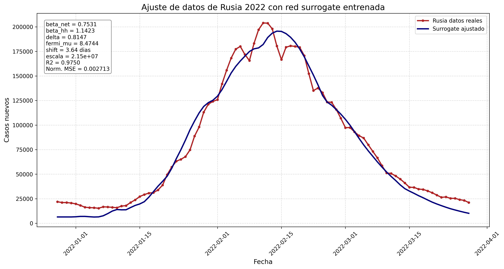
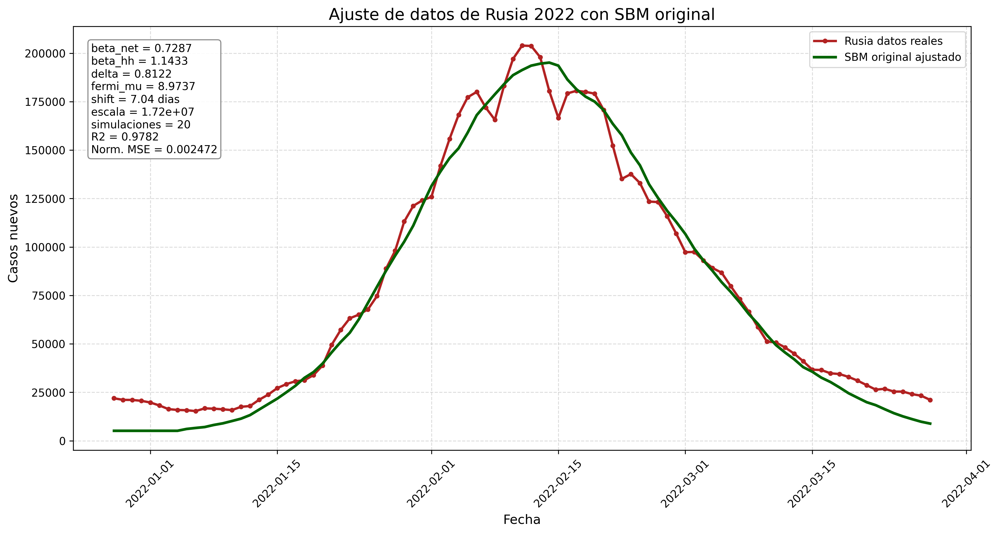
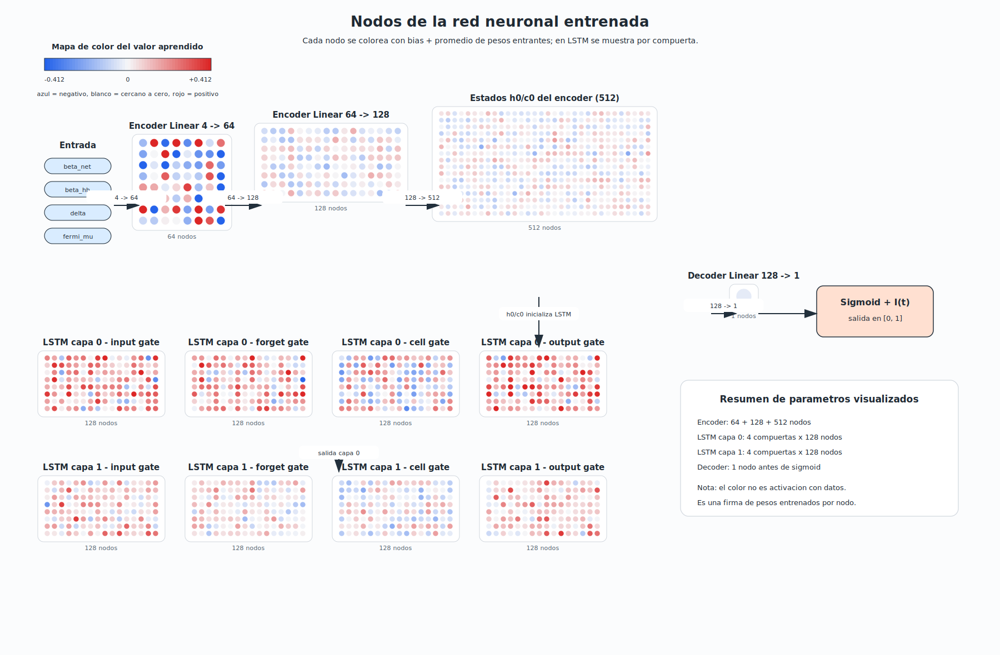

# Modelado epidemiologico SBM-SIR con surrogate de AI

Este proyecto implementa un pipeline de modelado epidemiologico computacional para simular una epidemia sobre redes tipo SBM, entrenar un modelo surrogate basado en AI y comparar el comportamiento del modelo con datos reales de casos diarios de Rusia 2022.

La idea central es combinar dos enfoques:

1. Un modelo mecanicista SBM-SIR que simula contagios sobre una red poblacional con estructura espacial, hubs y poblacion movil/estatica.
2. Una red neuronal surrogate que aprende a aproximar las curvas generadas por el simulador original, permitiendo evaluar parametros de forma mas rapida.

El ajuste con datos reales es fenomenologico: el modelo produce una fraccion infectada simulada y luego se escala a casos diarios reportados.

## Objetivo

Desarrollar y evaluar un modelo epidemiologico basado en redes que permita:

- Generar una red sintetica tipo Stochastic Block Model (SBM).
- Incorporar restricciones espaciales mediante una funcion tipo Fermi-Dirac.
- Simular dinamicas SIR sobre poblacion estratificada.
- Entrenar una red neuronal surrogate para aproximar el simulador.
- Ajustar el surrogate y el SBM original contra datos reales de Rusia 2022.
- Comparar el desempeno del surrogate frente al modelo original.

## Pipeline general

```text
Parametros epidemiologicos y espaciales
        |
        v
Generacion de red SBM con hubs y posiciones 2D
        |
        v
Proyeccion de hubs a conexiones entre manzanas
        |
        v
Simulacion SIR estocastica sobre la red
        |
        v
Dataset sintetico de curvas epidemicas
        |
        v
Entrenamiento de surrogate LSTM autoregresivo
        |
        v
Ajuste a datos reales de Rusia 2022
        |
        v
Comparacion: surrogate vs SBM original
```

## Modelo mecanicista SBM-SIR

El simulador principal esta en `simple_sbm_generator.py`.

El modelo genera una red SBM con tres tipos de nodos:

- Bloques sociales.
- Hubs.
- Bloques no sociales.

Los nodos tienen posiciones en un espacio 2D y las conexiones se modulan por distancia usando:

```text
P(d) = 1 / (exp(beta * (d - mu)) + 1)
```

Donde:

- `d` es la distancia entre nodos.
- `beta` controla la pendiente de la transicion.
- `mu` representa el umbral espacial de conectividad.

Valores pequenos de `mu` representan conectividad local/restrictiva. Valores grandes de `mu` permiten conexiones a mayor distancia.

La simulacion SIR incluye:

- Poblacion movil y estatica por nodo.
- Infeccion interna tipo hogar/bloque.
- Infeccion externa por vecinos de red.
- Recuperacion estocastica.
- Multiples replicas para capturar variabilidad.

## Proyeccion de hubs

Los hubs representan lugares compartidos como:

- Oficinas.
- Transporte.
- Escuelas.
- Tiendas.

Cuando varias manzanas se conectan al mismo hub, el modelo proyecta ese hub como conexiones adicionales entre manzanas. Esto permite representar contactos indirectos por lugares comunes sin mantener los hubs como nodos finales de simulacion.


## Experimento espacial: mu pequeno vs mu grande

Se compararon dos escenarios:

| Escenario | Valor de `mu` | Interpretacion |
|---|---:|---|
| Restrictivo | 5 | Las conexiones dependen fuertemente de la cercania espacial |
| Libre | 15 | La distancia limita menos la conectividad |

Resultados reportados por simulaciones repetidas:

| Metrica | Mu pequeno / restrictivo | Mu grande / libre |
|---|---:|---:|
| Pico promedio de infectados | 1240.67 +/- 281.88 | 7523.32 +/- 330.77 |
| Infectados acumulados | 35379.82 +/- 6605.26 | 76344.08 +/- 1284.00 |
| Infectados en ultima iteracion | 244.47 +/- 193.59 | 0.00 +/- 0.00 |


## Dataset sintetico para AI

El dataset se genera ejecutando el simulador original con distintos parametros:

- `beta_network`
- `beta_household`
- `delta`
- `fermi_mu`

Archivo generado:

```text
output/ai_sbm/dataset_normalized.npz
```

Dimensiones actuales:

| Variable | Dimension |
|---|---:|
| `X` parametros | 300 x 4 |
| `Y` curvas infectadas | 300 x 100 |

Rangos observados en el dataset:

| Parametro | Minimo | Maximo |
|---|---:|---:|
| `beta_network` | 0.1094 | 0.7999 |
| `beta_household` | 1.0027 | 3.4988 |
| `delta` | 0.6024 | 1.1966 |
| `fermi_mu` | 2.0014 | 19.9462 |

Cada curva `Y` representa la fraccion infectada promedio normalizada por poblacion.

## Modelo surrogate de AI

El surrogate esta definido en `AI_SBM.py` como `EpidemicSurrogateNet`.

Arquitectura:

- Entrada: 4 parametros epidemiologicos/espaciales.
- Codificador MLP para transformar parametros en estado inicial.
- LSTM autoregresiva para generar la curva temporal.
- Salida: curva de fraccion infectada a lo largo de 100 pasos.

La perdida de entrenamiento combina:

- MSE de la curva completa.
- Error en el pico epidemico.
- Error en la primera derivada temporal.
- Error en la segunda derivada temporal.

Esto fuerza al surrogate a aprender no solo el valor punto a punto, sino tambien la forma dinamica de la epidemia.



## Evaluacion del surrogate

Metricas actuales sobre particion de prueba:

| Metrica | Valor |
|---|---:|
| MSE | 0.00000427 |
| MAE | 0.00082234 |
| R2 | 0.9872 |

Archivo:

```text
output/ai_sbm/eval_metrics_normalized.txt
```

Validacion visual del surrogate contra el simulador original:


## Datos reales: Rusia 2022

El archivo `Data_Rusia_2022.csv` contiene casos nuevos diarios de Rusia. Los datos reales fueron obtenidos del dashboard oficial de la Organizacion Mundial de la Salud:

```text
https://data.who.int/dashboards/covid19/data?utm_source=chatgpt.com
```

Periodo incluido:

| Inicio | Fin | Dias |
|---|---|---:|
| 2021-12-28 | 2022-03-28 | 91 |

La variable usada para el ajuste es:

```text
Casos nuevos
```

Visualizacion directa de la serie real usada como referencia:



## Ajuste con surrogate a Rusia 2022

Script:

```text
fit_rusia_with_surrogate.py
```

El ajuste usa `differential_evolution` para buscar parametros del surrogate y un desplazamiento temporal (`shift_days`). Luego escala la fraccion infectada simulada a casos reales.

Parametros optimos actuales:

| Parametro | Valor |
|---|---:|
| `beta_net` | 0.7530654572 |
| `beta_hh` | 1.142348201 |
| `delta` | 0.8147158245 |
| `fermi_mu` | 8.474368556 |
| `shift_days` | 3.640185258 |
| `scale_cases` | 21491861.58 |

Metricas:

| Metrica | Valor |
|---|---:|
| MSE | 94290892.27 |
| MAE | 7917.95224 |
| R2 | 0.97495529 |
| Shape MSE | 0.002713140376 |
| Optimizer loss | 0.002713140376 |



## Ajuste con SBM original a Rusia 2022

Script:

```text
fit_rusia_with_original_sbm.py
```

Este ajuste usa los parametros encontrados por el surrogate como semilla inicial y despues ejecuta el simulador SBM original con 20 replicas por evaluacion.

Parametros optimos actuales:

| Parametro | Valor |
|---|---:|
| `beta_net` | 0.7286968381 |
| `beta_hh` | 1.1433071362 |
| `delta` | 0.8121867768 |
| `fermi_mu` | 8.9737480256 |
| `shift_days` | 7.0372262655 |
| `scale_cases` | 17200827.1546 |
| `num_sims` | 20 |

Metricas:

| Metrica | Valor |
|---|---:|
| MSE | 82108155.8 |
| MAE | 7276.448763 |
| R2 | 0.9781911603 |
| Shape MSE | 0.002471826329 |
| Optimizer loss | 0.002471826329 |

Nota: el optimizador reporto `optimizer_success: False` porque alcanzo el limite maximo de evaluaciones. Aun asi, el ajuste final encontrado tiene buen desempeno numerico.



## Comparacion principal

| Modelo | R2 | MAE | Shape MSE |
|---|---:|---:|---:|
| Surrogate AI | 0.97495529 | 7917.95224 | 0.002713140376 |
| SBM original | 0.9781911603 | 7276.448763 | 0.002471826329 |

El SBM original logra un ajuste ligeramente mejor, pero el surrogate permite explorar el espacio de parametros de forma mas rapida. Esto justifica el uso del surrogate como herramienta de calibracion inicial o aproximacion eficiente del simulador.

## Comparacion de tiempos de ejecucion

Se midio el tiempo de evaluacion usando los parametros optimos del SBM original:

```text
beta_net = 0.7286968381
beta_hh = 1.1433071362
delta = 0.8121867768
fermi_mu = 8.9737480256
```

La comparacion mide el tiempo para generar una curva epidemica de 100 pasos. En el surrogate se mide inferencia con el modelo ya entrenado; no incluye el tiempo de entrenamiento. En el SBM se mide la simulacion mecanicista directa.

| Modelo | Configuracion medida | Tiempo |
|---|---:|---:|
| Surrogate AI | 1 prediccion | 0.00498 s |
| Surrogate AI | 1000 predicciones | 4.97563 s |
| SBM original | 1 simulacion | 1.20093 s |
| SBM original | 20 simulaciones | 2.77914 s |

Comparacion de velocidad:

| Comparacion | Aceleracion aproximada |
|---|---:|
| Surrogate vs SBM con 1 simulacion | 241.4x mas rapido |
| Surrogate vs SBM con 20 simulaciones | 558.6x mas rapido |

Interpretacion: el SBM original conserva la dinamica mecanicista completa y logra un ajuste ligeramente mejor, pero cada evaluacion es mucho mas costosa. El surrogate permite explorar muchos parametros de forma rapida y por eso es util como aproximador inicial para calibracion.

## Galeria de resultados

Esta seccion concentra las figuras principales generadas por el proyecto.

### Red SBM y efecto espacial


### Arquitectura y surrogate





### Ajuste a datos reales


## Archivos principales

| Archivo | Descripcion |
|---|---|
| `simple_sbm_generator.py` | Generador SBM, proyeccion de hubs y simulacion SIR |
| `test_simulation.py` | Configuracion numerica y experimento espacial base |
| `AI_SBM.py` | Generacion del dataset, arquitectura surrogate, entrenamiento y evaluacion |
| `fit_rusia_with_surrogate.py` | Ajuste del surrogate contra datos reales de Rusia |
| `fit_rusia_with_original_sbm.py` | Ajuste del simulador SBM original contra datos reales |
| `Data_Rusia_2022.csv` | Datos reales de casos diarios |
| `model_output.py` | Contenedor simple para resultados SIR |

## Salidas generadas

| Archivo | Descripcion |
|---|---|
| `plot_rusia_2022.png` | Visualizacion de los datos reales de Rusia 2022 |
| `output/infectados_mu_small_vs_mu_infty.png` | Comparacion de epidemias con distinta restriccion espacial |
| `output/simple_sbm_comparison.png` | Comparacion de red original y red proyectada |
| `output/ai_sbm/dataset_normalized.npz` | Dataset sintetico para entrenar el surrogate |
| `output/ai_sbm/surrogate_model_normalized.pth` | Pesos entrenados del surrogate |
| `output/ai_sbm/eval_metrics_normalized.txt` | Metricas del surrogate |
| `output/ai_sbm/estructura_red_lstm_surrogate.svg` | Diagrama de la arquitectura LSTM surrogate |
| `output/ai_sbm/arquitectura_red_entrenada_colormap.png` | Visualizacion de la arquitectura entrenada |
| `output/ai_sbm/nodos_red_entrenada_colormap.svg` | Visualizacion de nodos de la red entrenada |
| `output/ai_sbm/validacion_surrogate_comparativa_normalizada.png` | Validacion visual surrogate vs simulador |
| `output/ai_sbm/ajuste_rusia_surrogate_shift.txt` | Parametros y metricas del ajuste surrogate |
| `output/ai_sbm/ajuste_rusia_surrogate_shift.png` | Grafica del ajuste surrogate |
| `output/ai_sbm/ajuste_rusia_sbm_original_20sims.txt` | Parametros y metricas del ajuste SBM original |
| `output/ai_sbm/ajuste_rusia_sbm_original_20sims.png` | Grafica del ajuste SBM original |

## Como ejecutar

Instalar dependencias:

```bash
pip install numpy scipy networkx matplotlib pandas scikit-learn torch
```

Ejecutar el pipeline de AI:

```bash
python3 AI_SBM.py
```

Ajustar el surrogate contra Rusia:

```bash
python3 fit_rusia_with_surrogate.py
```

Ajustar el SBM original contra Rusia usando la semilla del surrogate:

```bash
python3 fit_rusia_with_original_sbm.py --num-sims 20 --maxiter 25 --maxfev 80
```

## Limitaciones

- El ajuste a datos reales es fenomenologico, no causal.
- El modelo usa una red sintetica, no una red real de movilidad de Rusia.
- La escala de casos reportados se ajusta posteriormente mediante `scale_cases`.
- El R2 alto indica buen ajuste de forma, pero no prueba que los parametros sean identificables de forma unica.
- El ajuste del SBM original actual alcanzo el limite de evaluaciones del optimizador.
- Para una tesis formal conviene agregar analisis de sensibilidad, intervalos de confianza y comparaciones contra modelos base.

## Interpretacion academica

Este proyecto corresponde a un trabajo de AI aplicada y modelado computacional. Su contribucion principal es usar una red neuronal surrogate para aproximar un simulador epidemiologico basado en redes y emplearla como herramienta de ajuste frente a datos reales.

Una formulacion adecuada para tesis seria:

```text
Modelo epidemiologico basado en redes SBM con surrogate neuronal autoregresivo para calibracion eficiente frente a datos reales de incidencia.
```
